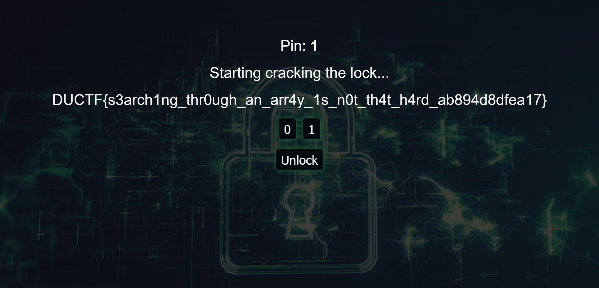

# js lock

---
Opening up `js-lock.html` in the browser, we're presented with some text and 3 buttons labeled, '0', '1' and 'Unlock'.


Upon inspection of the JS code, there's a massive Base64 string that gets passed into `atob()` and `eval` and assigned to `LOCK`. Looking at `LOCK` in the console shows an array containing some numbers and deeply nested arrays. Further inspection reveals the most important function in the challenge, `win()`. 

```
function submit_pin() {
    S.idx = 0
    if(S.T === S.current) {
        set_status(`<div style="color: green">Pin ${S.current} unlocked!</div>`)

        if(S.current == 1337) {
            win()
        } else {
            S.current += 1
            document.getElementById("current-pin").innerText = S.current
            S.T = LOCK
        }
    } else {
        set_status(`<div style="color: red">Pin ${S.current} didn\'t unlock!</div>`)
        disable()
    }
}

async function win() {
    const K = await sha512(S.key)
    const dec = []
    for(var i = 0; i < 64; i++) {
        dec.push(String.fromCodePoint(C[i] ^ K[i]))
    }
    const flag = dec.join('')
    set_status(flag)
}
```

The `win()` function seems to give us the flag by XORing the values contained in the `C` array and the SHA-512 hash of `S.key`. This `win()` function is called by `submit_pin()` only if `S.current == 1337` and `S.T == S.current`. 
So to get the flag, we need to somehow get `S.current == 1337`, have `S.T == S.current` and get the right value in `S.key`.

To gain a better understanding of `S.key`, we'll have a closer look at the object `S`. The variable, `S.current` is intialised with a 1 and the only instance where this variable is changed is in `submit_pin()` in the else clause that is only executed if `S.T === S.current && S.T != 1337`. In this else clase, the variable only gets incremented by 1 so we'll need to performance this operation 1336 times to satisfy the condition `S.current == 1337`. This else clause also resets the value of `S.T` to the `LOCK` array. As `S.T` is initialised to an array, fulfilling the condition, `S.T == S.current` would be difficult if it weren't for the functions, `hit_0()` and `hit_1()`.

```
const S = { current: 1, key: '', T: LOCK, idx: 0 }

function hit_0() {
    S.key += '0'
    if (typeof S.T != 'object' || S.T[S.idx] == undefined) {
        set_status(`<div style="color: red">Pin ${S.current} is stuck!</div>`)
        disable()
    } else {
        S.T = S.T[S.idx]
        S.idx = 0
        document.getElementById('current-attempt').innerText = S.key
    }
}

function hit_1() {
    S.key += '1'
    S.idx += 1
    document.getElementById('current-attempt').innerText = S.key
}
```

The simplest of these functions, `hit_1()` appends '1' to string `S.key`, increments `S.idx` and updates the DOM.

The function `hit_0()` however has some additional complexity. It appends `'0'` to `S.key` but if the type of `S.T` is not an object or if `S.T[S.dx]` is undefined, some red text gets displayed and all the buttons get disabled. In the else clause, `S.T` is assigned the value at `S.T[idx]` and `S.idx` gets reset to 0. 

To gain a better understanding of what these functions do, we'll step through the value of `S` in the console. These steps are also visualised in the GIF below. After the webpage is initally loaded, the variable `S` is initialised to `{ current: 1, key: "", T: (14) [因, idx: 0 }` where `S.T` is an array with 14 items. After clicking on the 1 button, `S` gets changed to `{ current: 1, key: "1", T: (14) [因, idx: 1 }`. Clicking on the same button twice appends '1' to `S.key` and increments `idx` two times resulting in `{ current: 1, key: "111", T: (14) [因, idx: 3 }`. A click on the 0 button completely changes the `S` variable to `{ current: 1, key: "1110", T: (1) [因, idx: 0 }`. A `'0'` gets appended to `S.key`, the value of `S.idx` gets reset to 0 and `S.T` gets changed to an array containing a single nested array. From this step through, it seems that `S` represents some pointer to a location in `LOCK` which also happens to resemble a tree data structure. `S.idx` represents the index of the array `S.T`, `S.current` is the value you want to find in `LOCK` and `S.key` represents the operations that were done to navigate `LOCK`.


With a better understanding of what the fields in `S` represent, we can begin to write a script to brute force the solution. First, we need to find `S.current` in `LOCK`, so we need to search through the entire array which can done by with the following function. The function returns a string containing the steps taken to find the `current` argument which will be given the value of `S.current`.

```
function getCurrent(val, current, pin) {
    if (typeof val === "number") {
        if (val === current) return pin;
        else return false;
    }
    let addedPins = '';
    for (let i = 0; i < val.length; i++) {
        let result = getCurrent(val[i], current, pin + addedPins + '0');
        if (result) return result;
        addedPins += '1';
    }
    return false;
}
```

We'll need to find the pins for every `S.current` value up to 1337 as well.

```
function get1337Pins() {
    const pinArr = [];
    for (let i = 1; i <= 1337; i++) pinArr.push(getCurrent(S.T, i, ''));
    return pinArr;
}
```

Once every pin has been found, we'll need to start entering the input. However, calling `hit_0()` and `hit_1()` would severely impact the script's performance due to the number of DOM operations that will have to be performed, so the functions were copied and pasted with most of the DOM operations removed to improve performance.

```
function fake_0() {
    S.key += '0';
    if(typeof S.T != 'object' || S.T[S.idx] == undefined) {
        disable()
    } else {
        S.T = S.T[S.idx]
        S.idx = 0
    }
}

function fake_1() {
    S.key += '1'
    S.idx += 1
}

function clickOnFakePins(pass) {
    for (let i = 0; i< pass.length; i++) {
        if (pass[i] == '0') fake_0();
        else fake_1();
    }
}

function fake_submit_pin() {
    S.idx = 0
    if(S.T === S.current) {

        if(S.current == 1337) {
            win()
        } else {
            S.current += 1
            S.T = LOCK
        }
    } else {
        set_status(`<div style="color: red">Pin ${S.current} didn\'t unlock!</div>`)
        disable()
    }
}

```

Finally, to get the flag to display on the page, we execute the following:

```
const pinArr = get1337Pins();
for (let i = 0; i < 1337; i++) {
    clickOnFakePins(pinArr[i]);
    fake_submit_pin();
}

submit_pin();
```

After waiting a couple of seconds, we finally get the flag!

>DUCTF{s3arch1ng_thr0ugh_an_arr4y_1s_n0t_th4t_h4rd_ab894d8dfea17}


